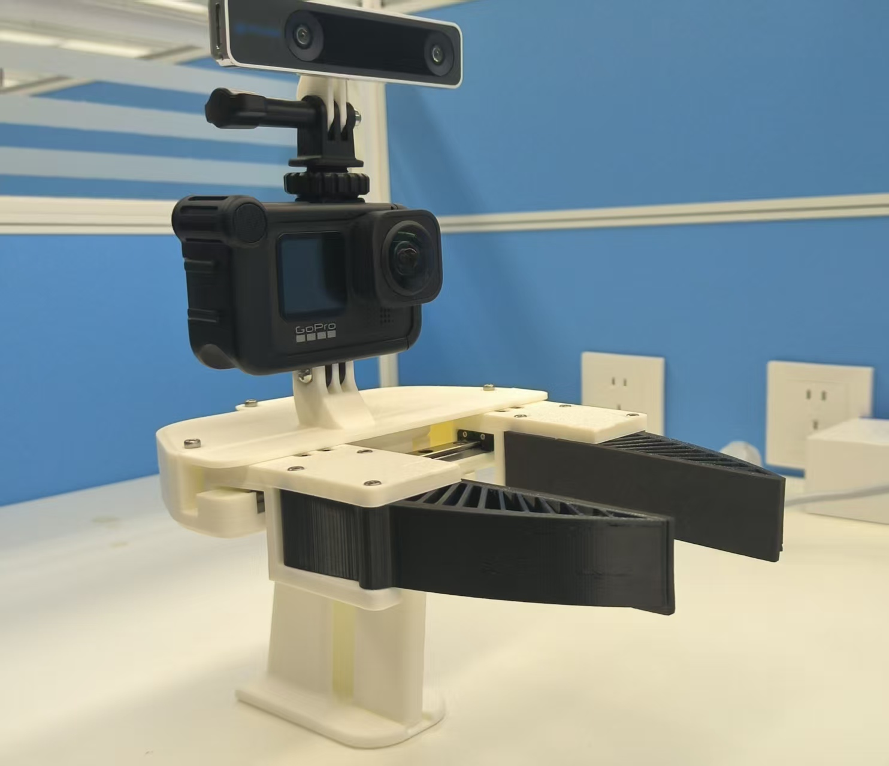
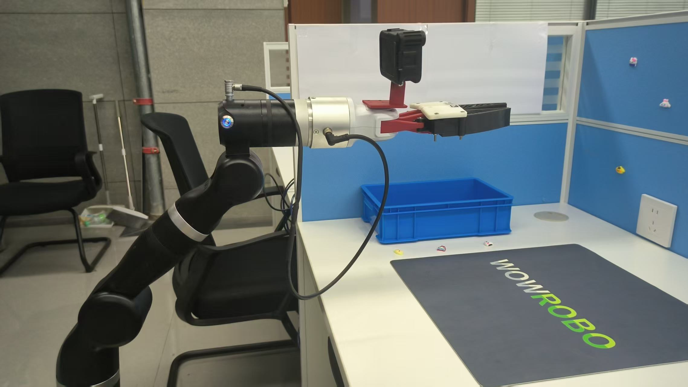
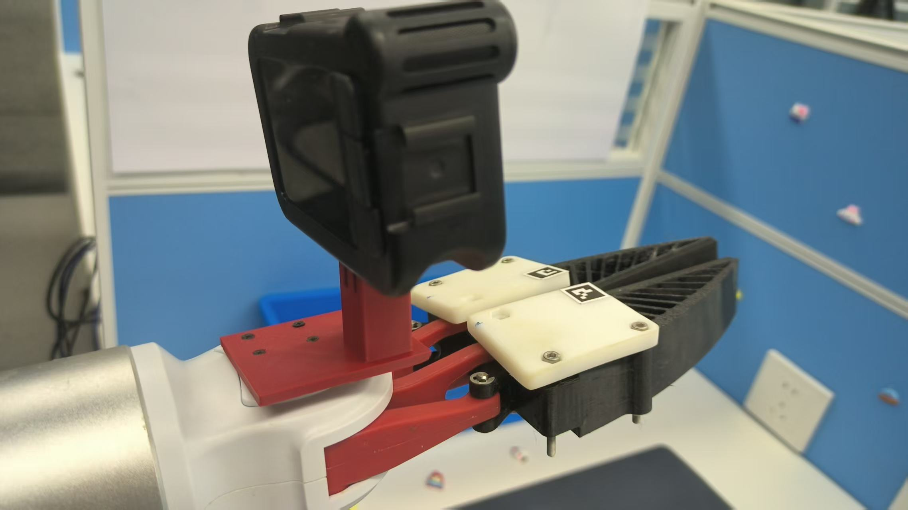

本仓库用于记录复现 [FastUMI](https://fastumi.com/)过程，并扩展适配到 Realman Gen72 机械臂，包括硬件适配，数据采集，模型训练和推理执行,并完成一个抓取示例。

## 1. 项目结构

```
UMI/
├── dataset/           # 存储采集的数据和数据集
├── assets/            # 资源文件
├── models/            # 存储训练好的模型
├── scripts/           # 实用脚本
├── src/               # 源代码
│   ├── data_collection/   # 数据采集模块
│   ├── data_processing/   # 数据处理模块
│   ├── training/          # 模型训练模块
│   ├── inference/         # 模型推理模块
│   └── robot_control/     # 机械臂控制模块
├── tests/             # 单元测试
├── docs/              # 文档
└── configs/           # 配置文件
```

### 1.1 安装要求

- Python 3.10.4
- CUDA (用于GPU加速, 可选)
- ROS (用于机器人控制)

### 1.2 安装步骤

1. 克隆仓库：
```bash
git clone https://github.com/CortexNest/UMI.git
cd UMI
```

2. 创建虚拟环境：
```bash
conda create -n FastUMI python=3.10.4
conda activate FastUMI
```

3. 安装依赖：
```bash
pip install -r requirements.txt
```

4. 安装 pre-commit hooks：
```bash
pre-commit install
```

### 1.3 代码质量工具

项目使用 pre-commit 在提交代码前自动运行检查：

```bash
pre-commit run --all-files  # 手动运行所有检查
```

## 2. 硬件环境

### 2.1 采集夹爪
采集端使用FastUMI采集设备，硬件列表及制作：

| Device Name | Google Drive 3D Model | Link (Amazon) | Link (Taobao) |
|------------|---------------------|---------------|---------------|
| GoPro Official Media Mod | | [Amazon Link](https://www.amazon.sg/GoPro-Official-Media-Modular-ADFMD-001/dp/B08WC6JZ14/ref=sr_1_4?crid=27DWJQBHAABVR&dib=eyJ2IjoiMSJ9.kqoJhgRSqIfAUrrC_8m99o2J9kah_bdqh_blDF-kb2o07fx-bURKFYzs-CCrmZidHkVxjXvxn3_DLkeO2b7wkBIwuv9OqwfSZAlzfvWxNgiFamJIlN38HLeSmo8Zwk6T0B9RM0Nv_0HttWqHo--yhVTL0liQjD185uyhy14r9RrLRy94hTa3D6iA-qPnX7ePGI0w3m_c0zP4QZBpDKOpg9Yofk7N_Bi0nYZX9UR-cQSlAZjc9smJ-O2INN5DsvHsEUiPMDjg7-2H8RawcYKpbjTJLoW4lKGC0WVDzpeYLhMnkS1-zx9R0Aiqke49bKSXTtmd6hjIEC-JENvy0UKnsxDNoY1HzSuAEoajMuKRoLEmQ-nnc6eYK50dzTOAFfLCT-d01EMBBwJYV1vWc_G2VJNCiXNm2xECLk-wSkQmqR6VMBae9OjoHN8s-aLtyG80.rWgLssnUeusuVaI5WE5ONaeb63bB7Rdn6QR1rBkm1oE&dib_tag=se&keywords=media%2Bmod%2Bgopro&qid=1735198017&sprefix=media%2Bmod%2Bgopro%2Caps%2C470&sr=8-4&th=1) | [Taobao Link](https://item.taobao.com/item.htm?abbucket=14&id=617788495597&ns=1&spm=a21n57.1.item.6.2f11523cDUfPUy) |
| Gopro Hero9 Hot Adaptor | | [Amazon Link](https://www.amazon.sg/NICEYRIG-Adapter-Action-Applicable-Monopod/dp/B08ZJ2RCLF) | [Taobao Link](http://e.tb.cn/h.gHjuuA6qS8e59bg?tk=C1OT38F1iK4) |
| Micro to hdmi cable | | [Amazon Link](https://www.amazon.sg/UGREEN-Adapter-Braided-Support-Compatible/dp/B08P5QSG5M/ref=sr_1_4_sspa?dib=eyJ2IjoiMSJ9.oVBO0d-c_X9eOwS4N_If7EAjBU5NRra-I9eTdyEczkdx__DkZ4Li8Re4qOQc2Bi02uFYbVDSq75QRLTSy-rb8ZQsrUxIfbwO9haU2uoUH7HK5j7jNzpRdSEIE3yg0W-c-yGlQfDzPwkF5XpPXFrmITegLpNOr6KRXC0QOKvKNKha2j5BJ6MrC_9xKZ309YMIAoC_0lUpnlnOh575LHjHP9UqrLk-SkGmG1CRY2gAZDMuJmFNRA4wNlA0T5Iy30opAgRKPx2D0SBStPuDcd28_nbNSrKoeY3az7Y-yLcm7Uo.FsGqZVsgzp7zmeacXaPpSTOWLX8Yiy-w00WvGiUFm38&dib_tag=se&keywords=Micro%2Bto%2Bhdmi%2Bcable&qid=1735199111&sr=8-4-spons&sp_csd=d2lkZ2V0TmFtZT1zcF9hdGY&th=1) | [Taobao Link](http://e.tb.cn/h.TUXGvuB4v25mOz4?tk=EsDw3CbUKSP) |
| Capture Card | | [Amazon Link](https://www.amazon.sg/Elgato-HD60-1080p60-ultra-low-latency/dp/B09V1KJ3J4/ref=sr_1_9?crid=13DNDH7CEY5XD&dib=eyJ2IjoiMSJ9.6zz3n9zJZ2DOp_hdrpldcuodM93-Ddp9l6zrMJ5XenAmNo6ue09K53O4u6YihSL9U7ZxuJ8iz4dirL2f2iBtGTFQoLucuJEzwRkEouzk2N2L03rQSwcfmsfOxSvd2fxWl7o_10bRzliZxurQCQOwR84jvaq4JLdUmV1ZUh_k_7xd4FdfKIOzfKo7YiW37P6IKCWiL_yCzIObHF_xVkOxJk81PONuT0eEpYLTs-Y47HRSivjIm0xUiryRAaPblttuixgcgI-_DmlXpftaWBb-FeafSPM9kD6Jisf1T6RBUifZwhb9l57rMe9GPGc74i6UxhubS6huSS5O3weNhMMkgx0816dgRotLoL-PS_iP8021DEEgzvDrJk5fxf-WptpBcFt5eMwpRtY2wf-QU9igHTl4rAq8BIcUJCc8f7ur3sf-IMoRZhBs8Wjn3cC7AaU2.vMIBuAhjXoZcnx9de2_9LFnRlKbL0OJcRR9YXpnlAFk&dib_tag=se&keywords=Capture%2BCard&qid=1735199299&sprefix=capture%2Bcard%2Caps%2C905&sr=8-9&th=1) | [Taobao Link](http://e.tb.cn/h.gxfjlKYLHl1aNHX?tk=cit43n9NUxj) |
| USB3.0 to Micro B cable | | [Amazon Link](https://www.amazon.sg/UGREEN-Charging-Compatible-Passport-Elements/dp/B00P0C4M3Y/ref=sr_1_3?crid=26QPMMS85KFQJ&dib=eyJ2IjoiMSJ9.bbwxaEMraWhjbRqJe1ctpo-fqm-61qqH19NsCymTDRYfpeIfWvGis8NpvrkubtbiQi5TMd4QtZlXy0Pa8e9GPl32RJpw_lZwm37dP5TXyd6p3QaBZRP3n4WnvKLUGIAv1C2omb-bDijaT-ZbM0Dapu8MS5qbRSVW0prMtRT8xUo7Zrd13-joNYeN6vaLNJdj6EPoaaBCMBRtj0qPJy1GTNOncDwyjHgL_4pCz3H9Px8FOpulhl36sM0urOBSGSJvYyomfMypyipp1noCdegClUbWsqyxEFsJH3pwHxkr64W9C_-h6jq8hpz16cFhW1yjtpU9DFcFEVa6ZRVkqrox1vaD49PWdTEMt2YyK6-oapH-3EmduV2mwnddNSC4MpFMuj0hnkdVTsQ4mTjr2CypIKg9QuXpUKppMZSQl051AQcU88OOxcTfxs1Dju9Yo12P.l0TF5erEUzhORkkrOo2FR5ZjbDww25mPXOU_gmhKCUg&dib_tag=se&keywords=USB3.0+to+Micro+B+cable&qid=1735199387&sprefix=capture+card%2Caps%2C1130&sr=8-3) | [Taobao Link](https://item.taobao.com/item.htm?abbucket=9&id=751933470886&ns=1&pisk=f8gihss4jgfjDhj3tHz6Vrbd3MxK51abfxQYHre2YJyCWoyvfxqmHvZqWPhtK-k-nS3tkqmCobGjWCav1PG_lrJJeULm1fab5tyldq4UYSFvkGPN7dhak19JeULJb6zDILHt6AvC87Vzu5r40WR3MS2V0xrV8XyQGSWagNRHtSwUgNra0JPUG7BV3x7N8yPTGN7V7r5FT72U3rzqLLSaeqor8pqNVqRrHduLsl2ckJQmf2_8f8l0LZJr-5X7UfyhuZ2t4oeIaxvGP5u0sDu4fH9iscmZBWMDrp4jdmk4iv8fLWgiw0Eijdb8humSMSDMSNztYDg_W2plNlD0Kuu0x9OQJjlU5RGprQMmwA002ALe_xaUNuomBp_4B0cEKu3dpaUjdmk4iv8fLWgiw0Eijdb8hoSraMSzRZQbTI3FciZaOW28BqVSn8DLMZAHtghbbWN7eBAhc6raOW2JtBj-2lPQN8C..&priceTId=2147820e17351995563972652e291d&skuId=5353101526163&spm=a21n57.1.hoverItem.3&utparam=%7B%22aplus_abtest%22%3A%222e74a367bc7863abd945bc40413d52e1%22%7D&xxc=taobaoSearch) |
| MGN9C 150mm Linear Rail | | [Amazon Link](https://www.amazon.com/ReliaBot-Linear-Carriage-Printer-Machine/dp/B09SD9N2Q5/ref=sr_1_5?crid=146KWHXHTOK8M&dib=eyJ2IjoiMSJ9.GZw7tIOaSBLr5R3M1lBzX9-sox_kprxBWLLyF3Ara0wIskYnPvufcte4fdmv24eSIAJGziH6TmV7yOccjxEoaa4hY_n-fow1wIxGJlUe9NkLidqxSxcFU3Q5VRnZKKyAw5V6rFhvAxPaSuPOSmdpd5AeAoSd3W1pWRBKiIEYsJQAYGRgVtChRBaBX_h4Bau6nj9iDV8JQAAW_Fdp9jzgxub904fMILajzGgcMazjPo0.i3i7Y9rT1MoOwYCwEcAcp3IWDZtef7OPBn_ttRquGpI&dib_tag=se&keywords=reliabot%2Blinear%2Brail&qid=1705618579&sprefix=reliabot%2Blinear%2Brail%2Caps%2C118&sr=8-5&th=1) | [Taobao Link](https://item.taobao.com/item.htm?_u=b2p28k7n5f0a&id=570924265589&spm=a1z09.2.0.0.20222e8dyVKeaQ&sku_properties=122276018%3A20213) |
| Spring 0.7mm*10mm*50mm | | [Amazon Link](https://www.amazon.com/gp/product/B09136RL45/ref=ppx_yo_dt_b_search_asin_title?ie=UTF8&th=1) | [Taobao Link](https://item.taobao.com/item.htm?_u=b2p28k7n4360&id=524072622923&spm=a1z09.2.0.0.20222e8dyVKeaQ) |
| GoPro Max Lens Mod 1.0(fisheye) | | [Amazon Link](https://www.amazon.com/GoPro-Max-Lens-HERO9-Black/dp/B08QCBP1S6/ref=sr_1_1?crid=1OPCVCF8W44EI&dib=eyJ2IjoiMSJ9.0ANQuhx9t7a7nAdGd1aQuxGqil7Pi_Gu68VSivTOeHIeo7WejvU2nFw3AKusP-A2oxKS4Xbq0eNnnQ5Pc9NvsMMhCuG7YzU1meB6DmeriRuKFfMe15oOQFuiGBdaoFrz55WTeQNM-OVhPJrq8eidX_9bzbNU_ms4cLSSSHc0WlNhLbzYN4hymyTJDsoQ6eYuxmLT9QzY13LblBJITDQXWNhtw9bzqnzXusoYN8YU3qY.CRFAnrHTWb57QUOT8ofwxUggfZs0F8cCImDBg5Ma5xw&dib_tag=se&keywords=gopro%2Bmax%2Blens%2Bmod&qid=1705619149&sprefix=%2Caps%2C136&sr=8-1&ufe=app_do%3Aamzn1.fos.18ed3cb5-28d5-4975-8bc7-93deae8f9840&th=1) | [Taobao Link](https://item.taobao.com/item.htm?abbucket=10&id=645032073117&ns=1&pisk=g8eE3DZ2zIpsnm2FrcDyQVIqy8kK6vbfL8gSquqoA20nRumoUP45v2ZlJzyrSuFCvb_p4HeauL9CJ6EkUYMllZ6fhkEZeYbXQubO3HnScQAkP4YMjYiPLN165kEKe4x6rsNgvUz-J6Aoq4jZI0oSqYcnEOYiW0Onrz0nsFmqDY0urzciS0oJ-0morFjZ0mAnr2cujFmo4DY3rYjajVnoHazuJduZtiIApsxFf_l-ok0wEK-xcXjQqQ9HKlonT84K7Gs_QDlEufew6dez0u2IQS8ltokThbwgQTJtdoPiImZdLdk0xWwKd579_V2aqJhjUOOnnlPuucehheoTOlqjSo-DnoDEcomLoZWI1yNiGS45qIu8fSluGXY61rq_cJhTUZ8iyWixImZdLdk0xWwKd579_V2aqJhjngrkycjMw8FerQlnXcufbGr3IhjPwF5TuQd-_1nZliIvwQhnocufDhdJwfSIbqsmI&priceTId=2150416f17343557644571851e0525&spm=a21n57.1.item.98.74f4523c1T7uZv&utparam=%7B%22aplus_abtest%22%3A%22863942c43d9f23d561c884d74ac17250%22%7D&xxc=taobaoSearch&skuId=5486134998821) |
| Gripper bottom plate | [Download Link](https://drive.google.com/file/d/1Pwz9hfXOd-SsjnWbYskusoWeYxeRpVnM/view?usp=drive_link) | | |
| Gripper top cover (redesigned) | [Download Link](https://drive.google.com/file/d/1I3rWegCsKVTpRRqgNHIaHz9mulDgT7bF/view?usp=drive_link) | | |
| Gripper grip | [Download Link](https://drive.google.com/file/d/1jnGtIeonDHH1azMgGanUGKkcWiq1nLMR/view?usp=drive_link) | | |
| Gripper handle | [Download Link](https://drive.google.com/file/d/1ua6Bggxtpg5UFV6PFm_PFeJNQuCfXpYm/view?usp=drive_link) | | |
| Finger holder (left) | [Download Link](https://drive.google.com/file/d/1GQnIX-ifGombWpN5S-1QD77umjGvoXpw/view?usp=drive_link) | | |
| Finger holder (right) | [Download Link](https://drive.google.com/file/d/1m71BhDZcLDbw78LRVuDB1pgnPzn-sPUH/view?usp=drive_link) | | |
| Gripper - gear (left) | [Document Link](https://drive.google.com/file/d/19pkYaAOk_Bvh_wF_Tw2BDhKNJ-Ub82GD/view?usp=drive_link) | | |
| Gripper - gear (right) | [Document Link](https://drive.google.com/file/d/1PRu5BUaI0kTnPuThdFy4KCjGtwwTAOPB/view?usp=drive_link) | | |
| Gripper linkage (left) | [Download Link](https://drive.google.com/file/d/1qKw2cCMWcFLi-hWtbN1qOwUV8XKl2s2F/view?usp=drive_link) | | |
| Gripper linkage (right) | [Download Link](https://drive.google.com/file/d/1_vO6an-GyXLgplN1rEmrh6NO_rI2ZT8o/view?usp=drive_link) | | |
| T265 Mount | [Download Link](https://drive.google.com/file/d/1ntXTOxU6KbD48_x4vxvExIkSOd4qAbLM/view?usp=drive_link) | | |
| T265 Mount V2 | [Download Link](https://drive.google.com/file/d/1_XOqXdYx--KOUCjkRI4ubGNVTrKC8_7T/view?usp=drive_link) | | |
| Markers | [Download Link](https://drive.google.com/file/d/1mi3dfh_kN559bwykRgol0a7hC730_6wT/view?usp=drive_link) | | |



### 2.2 机械臂
机械臂使用[Realman Gen72-B](https://www.realman-robotics.cn/products/gen72b)


### 2.3 执行末端
执行末端使用乐白[LMG-90](https://lebai.ltd/portfolio-item/lmg-90/), 并在其之上设计了Gopro[连接件](./assets/lebai_mount.step), 以及[软手指-需要打印两个](./assets/realman_finger.stp)，可以使用3D打印；



## 3. 数据采集及处理：

本仓库基于 [FastUMI采集代码](https://github.com/OneStarRobotics/FastUMI_Data)，但对其做了一些优化，数据采集步骤参考[数据采集](./docs/data_collection.md)

### 3.1 数据后处理
`configs/data_process.json`配置文件说明：
- **input_dir**: 原始数据路径
- **output_joint_dir / output_tcp_dir**: 输出数据路径
- **urdf_name**: URDF 文件的名称与后缀
- **base_position**: 机械臂的初始 TCP 的位置，单位为米
- **base_orientation**: 机械臂的初始 TCP 的旋转，单位为 rad
- **offset**: RealSense T265 相对于 TCP 的 offset
- **flange_to_tcp**: TCP 到法兰板的距离，单位为米
- **gripper_offset**: 非平行夹爪开合的距离误差
- **start_qpos**: 初始关节角度
- **gripper_threshold**: 夹爪开关阈值

#### 3.1.1 保存数据
- 保存为 hdf5 文件
```
python src/data_processing/data_save_hdf5.py --task your_task_name --num_episodes 1
```
- 保存为 ARIO 格式
```
python src/data_processing/data_save_ario.py --task your_task_name --num_episodes 1
```

#### 3.1.2 原始数据转化为TCP位姿数据
```
python src/data_processing/data_processing_to_tcp.py
```
#### 3.1.3 原始数据转化为关节角度数据
```
python src/data_processing/data_processing_to_joint.py
```

## 4. 模型训练及推理执行

FastUMI没有开放模型训练代码，本仓库补充了ACT算法及DP算法，可以使用不同的算法进行实验。

### 4.1 ACT（Action Chucking with Transformer) 算法
参考 [ACT 算法](./src/training/ACT/README.md)


### 4.2 DP(Difussion Policy) 算法
见 https://github.com/tpy001/Isaac-Sim-code， DP算法暂未合并到此仓库。
<!-- 参考 [DP 算法](./src/training/DP/README.md) -->

## 5. 路线图
- 移植ACT算法，使其适配采集数据格式，能够进行任务训练和推理, 能够控制Gen72-B机械臂执行任务
  - [x] 支持基于FastUMI共公开数据集的算法训练和推理
  - [x] 支持基于自采集数据的算法训练和推理
  - [x] 完成一个“将方块放到篮子里“ 的全流程任务
- 移植DP算法，使其适配采集数据格式，能够进行任务训练和推理, 能够控制Gen72-B机械臂执行任务
  - [x] 支持基于FastUMI共公开数据集的算法训练和推理
  - [x] 支持基于自采集数据的算法训练和推理
  - [ ] 完成一个“将方块放到篮子里“ 的全流程任务
- 集成Dora-kit
  - [ ] 基于Dora框架运行采集代码
  - [x] 存储数据为 [ARIO](https://ario-dataset.github.io/) 格式
  - [ ] 基于Dora框架运行ACT训练代码
  - [ ] 基于Dora框架运行ACT推理代码

## 6. 现状和不足
 - ACT算法目前可以完成将物体放到篮子里的任务，但泛化能力表现不足，待优化；
 - DP算法在仿真环境下可以完成从采集到训练到推理执行任务，但基于实际采集的数据暂无法很好执行；

## 7. 贡献指南

1. Fork 项目
2. 创建特性分支 (`git checkout -b feature/AmazingFeature`)
3. 提交更改 (`git commit -m 'Add some AmazingFeature'`)
4. 推送到分支 (`git push origin feature/AmazingFeature`)
5. 创建 Pull Request

### 8. 代码提交规范

- 提交前请确保通过所有代码检查
- 遵循项目的代码风格指南
- 添加适当的类型注解
- 编写清晰的文档字符串
- 添加必要的单元测试

## 9. 许可证

本项目采用 MIT 许可证 - 详见 [LICENSE](LICENSE) 文件

## 10. 联系方式

项目维护者 - [@CortexNest‌](https://github.com/CortexNest‌)

项目链接: [https://github.com/Core/CortexNest‌/UMI](https://github.com/CortexNest‌/UMI)
