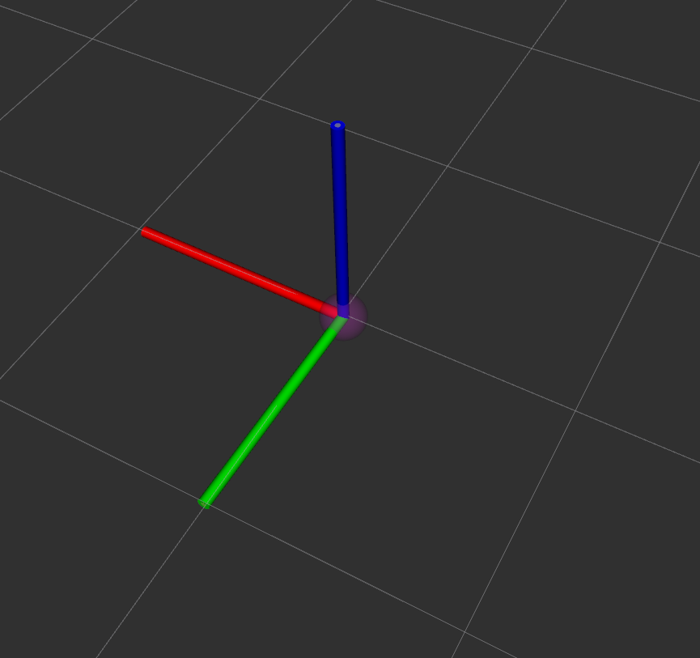
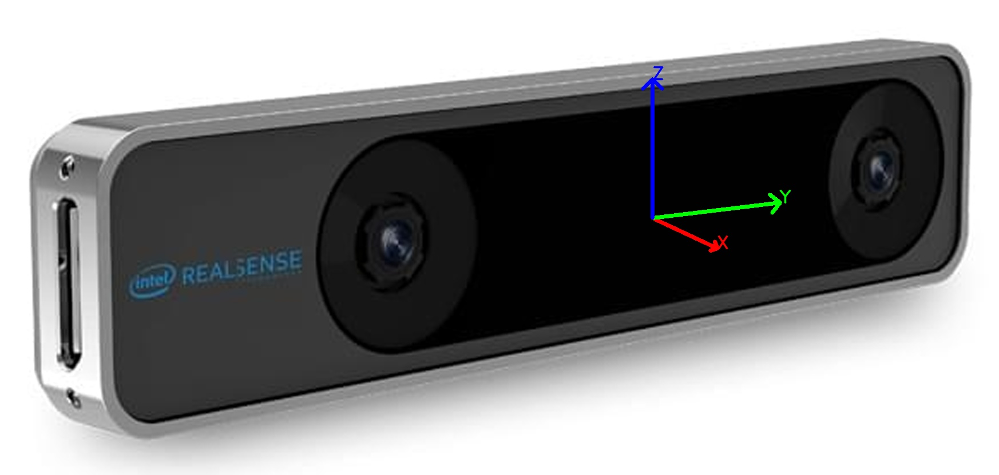
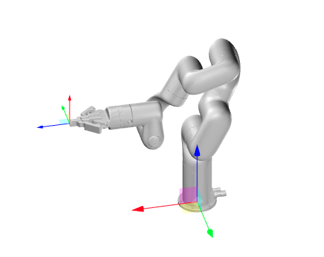

# Configuration Parameters Documentation

This document provides a brief explanation of the JSON configuration parameters used in the system, divided into three sections:

1. **Device Settings**
2. **Task Configuration**
3. **Data Processing Configuration**

---

## Table of Contents

1. [Device Settings](#device-settings)
2. [Task Configuration](#task-configuration)
3. [Data Processing Configuration](#data-processing-configuration)

---

## Device Settings

Defines the robot type, data directory, and computational device.

```json
"device_settings": {
    "robot_type": "GEN72",
    "data_dir": "./",
    "device": "cpu"
}
```

- **robot_type** (`string`): Type of the robot.
- **data_dir** (`string`): Path for data storage.
- **device** (`string`): Computational device.

---

## Task Configuration

Sets the task duration, state and action dimensions, camera settings, and ROS topics.

```json
"task_config": {
    "episode_len": 180,
    "state_dim": 7,
    "action_dim": 7,
    "cam_width": 1920,
    "cam_height": 1080,
    "camera_names": ["front"],
    "camera_port": 0,
    "ros": {
        "video_topic": "/usb_cam/image_raw",
        "trajectory_topic": "/camera/odom/sample",
        "queue_size": 1000
    }
}
```

- **episode_len** (`integer`): Length of each task episode, please adjust according to the task duration.
- **state_dim** (`integer`): Dimension of the state space.
- **action_dim** (`integer`): Dimension of the action space.
- **cam_width** (`integer`): Camera width in pixels.
- **cam_height** (`integer`): Camera height in pixels.
- **camera_names** (`array`): Names of the cameras.
- **camera_port** (`integer`): Camera port number.

### ROS Configuration

- **video_topic** (`string`): ROS topic for video data.
- **trajectory_topic** (`string`): ROS topic for trajectory data.
- **queue_size** (`integer`): Size of the ROS message queue.

---

## Data Processing Configuration

Manages data processing paths, markers, robot position, and initial joint states. 
We have already performed coordinate transformation in the code. The corresponding relationship diagram of coordinate transformation is shown below:


<figure align="center">
  
  
  <figcaption>Coordinate system of T265 in rviz</figcaption>
</figure>
<figure align="center">
  
  <figcaption>Coordinate system of Gen72</figcaption>
</figure>