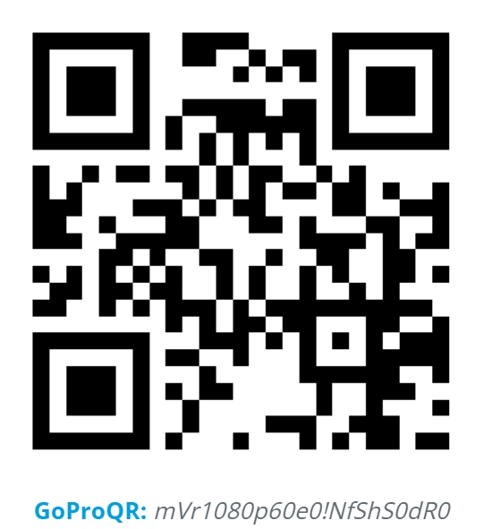

## 1. 🏠 Environment and GoPro Setup

We recommend using Ubuntu 20.04, kernel 5.15.0-131-generic, ROS noetic, Librealsense v2.53.1 (as T265 is not supported in later versions), and realsense2_camera v2.3.2.

To set up the environment, follow these steps:

### 1.1 🚀 ROS Installation

Ensure that ROS is installed on your system, see:

    http://wiki.ros.org/ROS/Installation

### 1.2 🔭 Python Environment
    # use python >= 3.8.0 and install dependency
    pip install -r requirements.txt

### 1.3 🛒 Install the necessary ROS packages

    sudo apt install python3-catkin-tools python3-rospkg python3-rosdep python3-rosinstall-generator
    sudo apt install ros-<ros-distro>-geometry-msgs ros-<ros-distro>-sensor-msgs ros-<ros-distro>-nav-msgs
    sudo apt install ros-<ros-distro>-cv-bridge
    sudo apt install ros-<ros-distro>-usb-cam

Replace `<ros-distro>` with your ROS distribution, e.g., `noetic`.

### 1.4 📺 Intel RealSense Dependencies
If your system is missing RealSense dependencies, follow these steps:
- Clone and install the [Intel RealSense library](https://github.com/IntelRealSense/librealsense).
- Alternatively, use the following commands to install the necessary libraries:
  ```
  sudo apt install ros-<ros-distro>-realsense2-camera
  sudo apt-key adv --keyserver keys.gnupg.net --recv-key 04A3CF2E
  sudo add-apt-repository "deb http://realsense-hw-public.s3.amazonaws.com/Debian/apt-repo $(lsb_release -cs) main"
  sudo apt update
  sudo apt install librealsense2-dkms librealsense2-utils librealsense2-dev librealsense2-dbg
  ```

### 1.5 📷 GoPro Setup
* Install GoPro Labs [firmware](https://gopro.github.io/labs/).
* Set date and time.
* Scan the following QR code for GoPro setting.
<br>
---

## 2. 📝 Workflow

### 2.1 🌏 Start ROS Core
Start the ROS master node:

    roscore

### 2.2 🪢 Connect RealSense T265 and GoPro
Launch the RealSense and USB camera nodes:

    roslaunch realsense2_camera rs_t265.launch
    roslaunch src/data_collection/usb_cam-test.launch

### 2.3 🎇 Open RViz for Visualization
Launch RViz:

    rviz

- Add **Odometry** and **Image** topics to visualize the data from the RealSense and GoPro cameras.

### 2.4 🏷️ Run Data Collection Script
- Update the data saving path in the script.
- Run the data collection script:
```python
python src/data_collection/collect.py --config configs/data_collection.json --task grasp_cube_v1_24 --num_episodes 6
```
---
